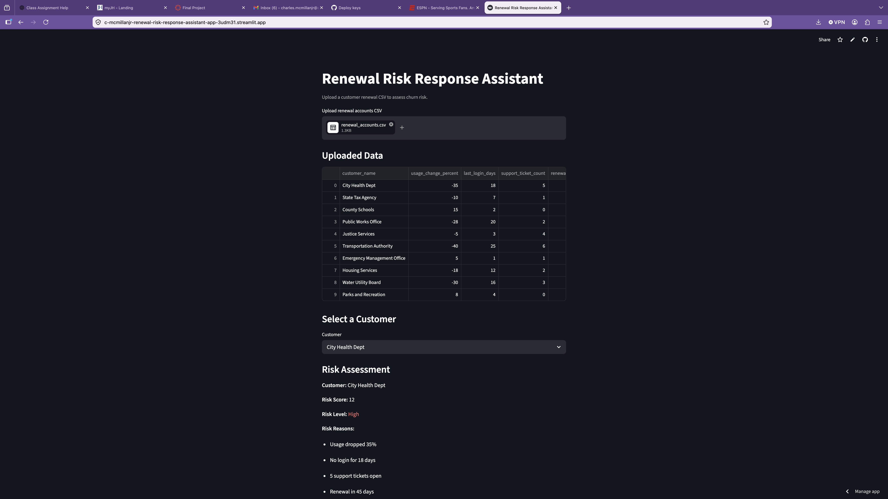
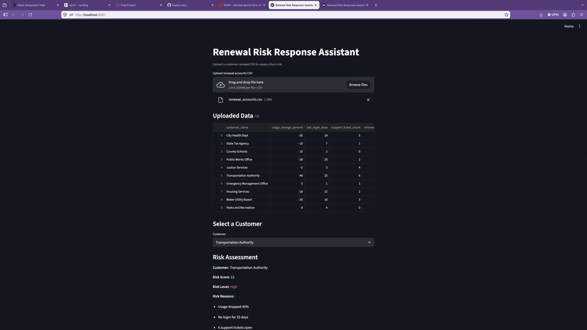
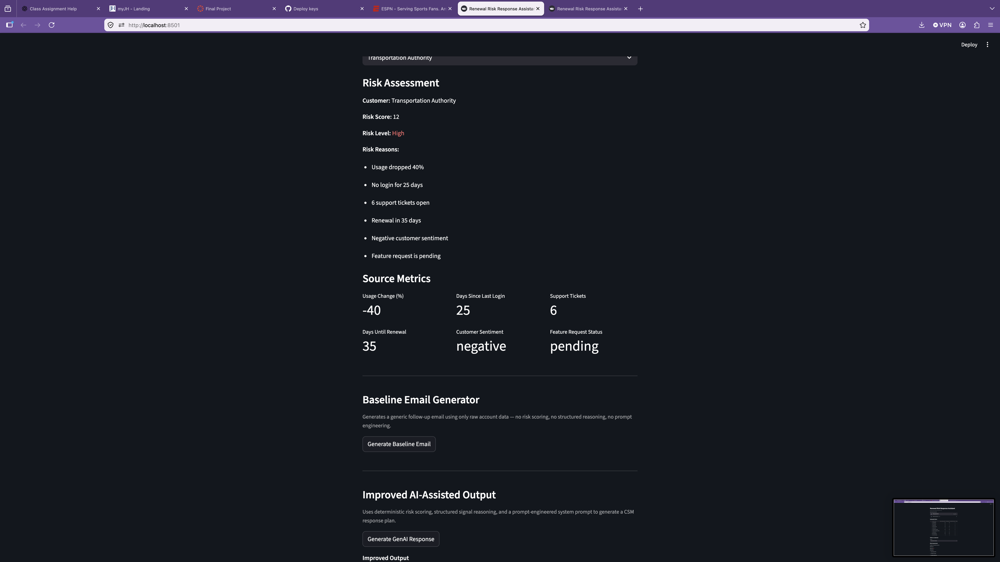
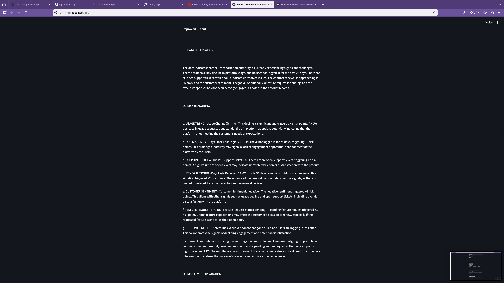
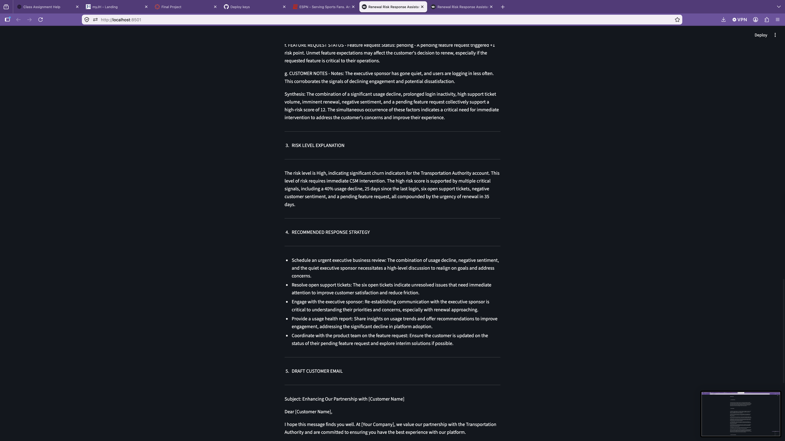
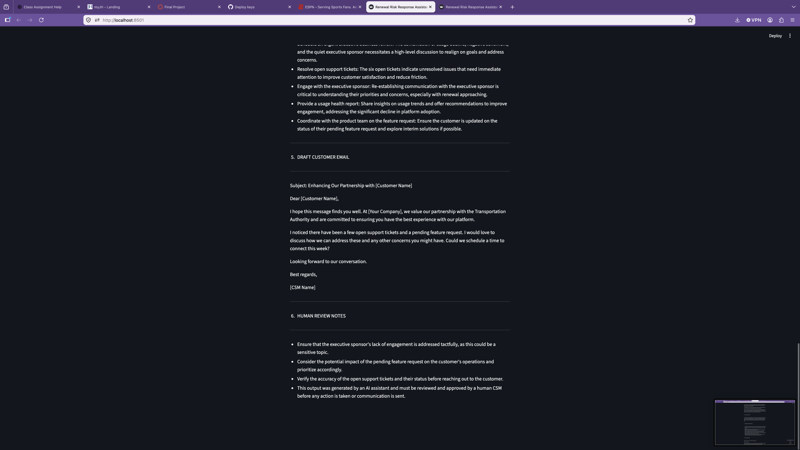

# Renewal Risk Response Assistant

**A hybrid GenAI application that combines deterministic risk scoring with structured AI-assisted reasoning to help Customer Success Managers prioritize and respond to at-risk renewal accounts.**

---

## 1. One-Sentence Summary

This tool analyzes customer renewal data from a CSV file, scores each account using a rule-based risk engine, and uses a prompt-engineered GenAI layer to generate structured response plans and draft emails for Customer Success Managers to review.

---

## 2. Context, User, and Problem

**User:** Customer Success Manager (CSM) at a SaaS company serving government and public sector clients.

**Context:** CSMs manage large portfolios of accounts approaching renewal. Each account produces signals — usage trends, login activity, support ticket volume, sentiment, and feature request status — that indicate whether a customer is likely to renew or churn. Reviewing and acting on these signals manually is time-consuming and inconsistent.

**Problem:** Without a structured workflow, CSMs may:
- Miss early warning signs in accounts with moderate risk
- Spend disproportionate time on low-risk accounts
- Send generic outreach emails that do not address the specific reasons an account is at risk
- Make reactive decisions instead of proactive ones

---

## 3. Business Workflow

The app is designed to support the following CSM workflow:

1. Export customer renewal data from a Tableau-style dashboard as a CSV file
2. Upload the CSV to the app
3. Select a customer from the dropdown
4. Review the deterministic risk score, risk level, and contributing signals
5. Generate a baseline email (simple, unguided) for comparison
6. Generate an improved AI-assisted response plan with structured reasoning
7. Review the output and edit as needed before taking action

The app is a **decision-support tool**. It accelerates the CSM's preparation but does not send emails, update CRM records, or take autonomous action.

---

## 4. Why GenAI Helps

Customer renewal risk involves qualitative judgment — interpreting what a combination of signals means, deciding how to frame a sensitive outreach email, and recommending a response strategy tailored to the account. These tasks benefit from natural language generation because:

- The same data signals mean different things in different combinations
- Email tone requires nuance that rule-based templates cannot provide
- Response strategies need to be explained in plain language, not just flagged

GenAI is well-suited to handle the **reasoning and communication** layer of this workflow. It is not suited to replace the deterministic scoring logic, which must be consistent and auditable.

---

## 5. Solution and System Design

The app uses a two-stage hybrid architecture:

```
CSV Upload
    │
    ▼
┌─────────────────────────────────┐
│  Stage 1: Deterministic Engine  │
│  scripts/risk_engine.py         │
│  - Validates CSV structure      │
│  - Scores 6 risk signals        │
│  - Classifies Low/Medium/High   │
│  - Returns structured output    │
└────────────────┬────────────────┘
                 │
                 ▼
┌─────────────────────────────────┐
│  Stage 2: GenAI Response Layer  │
│  prompts/renewal_prompt.txt     │
│  - Receives pre-scored input    │
│  - Reasons through 7 signals    │
│  - Produces 6 structured output │
│    sections                     │
│  - Enforces 9 safety rules      │
└────────────────┬────────────────┘
                 │
                 ▼
        CSM Reviews Output
```

**Why this separation matters:**
- The risk engine handles logic that must be deterministic, repeatable, and auditable
- The GenAI layer handles reasoning and communication that benefits from natural language generation
- Neither stage replaces the other — they are complementary

---

## 6. Deterministic Risk Engine

**File:** `scripts/risk_engine.py`

The risk engine applies fixed business rules to score each customer account. Scores are calculated as follows:

| Signal | Condition | Risk Points |
|---|---|---|
| Usage trend | Usage change ≤ -25% | +3 |
| Login activity | No login for ≥ 14 days | +2 |
| Support tickets | 3 or more open tickets | +2 |
| Renewal timing | Renewal within 60 days | +2 |
| Customer sentiment | Sentiment = negative | +2 |
| Feature request | Status = pending or unavailable | +1 |

**Risk levels:**
- **Low** (0–3): Monitor; no urgent action required
- **Medium** (4–6): Proactive outreach recommended
- **High** (7+): Immediate CSM intervention required

**Key functions:**
- `validate_csv(df)` — confirms all required columns are present
- `check_missing_values(df)` — identifies blank or null fields
- `calculate_risk(row)` — returns score, level, and reasons for one customer
- `analyze_customer(row)` — returns full structured output including data quality warnings
- `analyze_dataframe(df)` — processes all rows in the CSV

The engine can be run independently from the terminal:

```bash
python3 scripts/risk_engine.py
```

---

## 7. Baseline Workflow

The baseline represents the simplest possible AI-assisted approach: sending raw CSV data to GPT-4o with a single generic instruction.

**Prompt (simplified):**
> "Generate a professional customer-success follow-up email based on this customer account data."

**Characteristics:**
- No risk scoring or classification
- No structured output sections
- No safety rules or business guardrails
- No signal-by-signal reasoning
- Higher temperature (0.7) — more variation across runs
- Output is typically a single short email

The baseline is included in the app for **direct comparison** against the improved system. It demonstrates what a minimally-prompted AI produces without deterministic pre-processing or structured prompting.

---

## 8. Improved AI-Assisted Workflow

The improved system passes pre-scored, structured data from the risk engine into a prompt-engineered system prompt.

**Prompt file:** `prompts/renewal_prompt.txt`

**Required output sections:**
1. Data Observations
2. Risk Reasoning (signal-by-signal analysis of all 7 factors)
3. Risk Level Explanation
4. Recommended Response Strategy
5. Draft Customer Email
6. Human Review Notes

**Safety rules enforced by the prompt:**
- No promises of refunds, discounts, or pricing commitments
- No product roadmap timeline commitments
- No statements implying the customer will definitely churn
- No invented facts not present in the input data
- Every observation must trace back to a specific field or value
- Every output must close with a mandatory human review disclaimer

**Model settings:** GPT-4o, temperature 0.3 (more consistent across runs)

---

## 9. Evaluation Methodology

Five test cases were selected from `sample_data/renewal_accounts.csv` to represent a range of risk profiles:

| Account | Risk Score | Risk Level |
|---|---|---|
| City Health Dept | 12 | High |
| County Schools | 0 | Low |
| Transportation Authority | 12 | High |
| Housing Services | 0 | Low |
| Water Utility Board | 12 | High |

Each output was scored from **1 to 5** across five categories:

| Category | What it measures |
|---|---|
| Risk Accuracy | Does the output correctly identify the customer's risk level? |
| Reasoning Quality | Does it explain *why* the customer is at risk using specific signals? |
| Strategy Usefulness | Does it provide actionable, signal-specific CSM recommendations? |
| Email Professionalism | Is the draft email professional and appropriately toned? |
| Avoids Unsupported Promises | Does it avoid pricing, refund, roadmap, or churn certainty language? |

Full scoring details and per-category notes are documented in `evaluation/evaluation_results.md`.

---

## 10. Evaluation Results Summary

| Test Case | Baseline (/ 25) | Improved (/ 25) | Delta |
|---|---|---|---|
| City Health Dept | 13 | 23 | +10 |
| County Schools | 15 | 23 | +8 |
| Transportation Authority | 11 | 24 | +13 |
| Housing Services | 15 | 21 | +6 |
| Water Utility Board | 12 | 23 | +11 |
| **Average** | **13.2 (52.8%)** | **22.8 (91.2%)** | **+9.6** |

The improved system outperformed the baseline in every test case and every category. The largest gaps were in **Reasoning Quality** and **Risk Accuracy**, where the baseline consistently scored 1–2 due to the absence of structured analysis. The smallest gap was in **Email Professionalism**, where both systems produced acceptable output — confirming that email drafting alone does not justify the improved system's design.

---

## 11. Failure Cases and Limitations

1. **Rigid thresholds.** The risk engine uses fixed cutoffs. A customer at -24% usage scores zero for that signal despite being near the -25% threshold.

2. **Self-reported sentiment.** The `customer_sentiment` field is a manual CSM entry. Incorrect entries will propagate into the model's reasoning without detection.

3. **Unstructured notes field.** The model's ability to reason from the `notes` field depends on how clearly the CSM writes them. Vague notes reduce output quality.

4. **No historical context.** The system analyzes a single point-in-time snapshot. It cannot detect whether a trend is improving or worsening over time.

5. **Generic draft emails.** The draft email always uses placeholder values (`[CSM Name]`, `[Your Company]`) and requires human editing before it can be sent.

6. **Model can still hallucinate.** The prompt instructs the model not to invent facts, but this is not technically enforced. Human review remains essential.

7. **Low-risk accounts benefit less.** For accounts like County Schools (score: 0), both systems produced broadly similar output. The improved system adds the most value for high-risk accounts.

---

## 12. Human Oversight

This application is a **decision-support tool**, not a decision-making tool.

All outputs — from both the baseline and the improved system — require review and approval by a qualified CSM before any action is taken or communication is sent to a customer.

The improved system enforces this through a mandatory disclaimer appended to every Section 6 output:

> *"This output was generated by an AI assistant and must be reviewed and approved by a human CSM before any action is taken or communication is sent."*

The app does not send emails, update records, or take any autonomous action.

---

## 13. Project Structure

```
renewal-risk-response-assistant/
│
├── app.py                          # Streamlit application (main entry point)
├── requirements.txt                # Python dependencies
├── .env                            # API key (gitignored — not committed)
├── .gitignore                      # Standard Python + Streamlit ignores
├── README.md                       # This file
│
├── scripts/
│   └── risk_engine.py              # Deterministic risk scoring engine
│
├── prompts/
│   └── renewal_prompt.txt          # Structured GenAI system prompt
│
├── sample_data/
│   └── renewal_accounts.csv        # 10 mock customer renewal accounts
│
├── evaluation/
│   └── evaluation_results.md       # Baseline vs. improved evaluation
│
└── screenshots/                    # App screenshots for documentation
```

---

## 14. Setup Instructions

### Prerequisites
- Python 3.9 or higher
- An OpenAI API key ([platform.openai.com](https://platform.openai.com))

### Step 1 — Clone the repository

```bash
git clone https://github.com/c-mcmillanjr/renewal-risk-response-assistant.git
cd renewal-risk-response-assistant
```

### Step 2 — Create a virtual environment (recommended)

```bash
python3 -m venv venv
source venv/bin/activate        # Mac/Linux
venv\Scripts\activate           # Windows
```

### Step 3 — Install dependencies

```bash
pip install -r requirements.txt
```

### Step 4 — Create the .env file and add your API key

```bash
touch .env
```

Open `.env` and add:

```
OPENAI_API_KEY=sk-your-key-here
```

> The `.env` file is listed in `.gitignore` and will never be committed to GitHub.

### Step 5 — Run the app

```bash
python3 -m streamlit run app.py
```

The app will open at `http://localhost:8501`.

---

## 15. Usage Instructions

### Upload a CSV file
- Click **Browse files** and upload `sample_data/renewal_accounts.csv`
- The app validates the file and displays the full data table

### Select a customer
- Use the **Customer** dropdown to select any account
- The app immediately displays the deterministic risk score, risk level, risk reasons, and source metrics

### Generate the baseline output
- Click **Generate Baseline Email**
- The app sends raw account data to GPT-4o with a generic instruction
- A short follow-up email is returned with no structured reasoning

### Generate the improved AI-assisted output
- Click **Generate GenAI Response**
- The app sends pre-scored, structured data to GPT-4o using the system prompt
- The full 6-section response plan is returned

---

## 16. Example Workflow

**Account:** Transportation Authority
**Risk Score:** 12 | **Risk Level:** High

**Key signals identified by the risk engine:**
- Usage dropped 40% (-3 pts)
- No login for 25 days (-2 pts)
- 6 support tickets open (-2 pts)
- Renewal in 35 days (-2 pts)
- Negative customer sentiment (-2 pts)
- Feature request is pending (-1 pt)

**Baseline output:** A short, polite email referencing "a few open tickets" with no urgency or strategic context.

**Improved output:** A 6-section response plan including signal-by-signal analysis, an urgent EBR recommendation, a professionally worded draft email that references support tickets and usage trends without alarming language, and a human review checklist — all grounded in the specific data signals above.

---

## 17. Screenshots / Artifact Snapshot

**Live deployed app:** [c-mcmillanjr-renewal-risk-response-assistant-app-3udm31.streamlit.app](https://c-mcmillanjr-renewal-risk-response-assistant-app-3udm31.streamlit.app)

**Demo video:** [`screenshots/demo_walkthrough.webm`](screenshots/demo_walkthrough.webm)

---

### App Upload and Data Table


---

### Risk Assessment and Source Metrics — Transportation Authority


---

### Baseline Email Generator and Improved AI-Assisted Output Sections


---

### Improved Output — Data Observations and Risk Reasoning (All 7 Signals)


---

### Improved Output — Recommended Response Strategy and Draft Customer Email


---

### Improved Output — Human Review Notes


---

## 18. Future Improvements

1. **Trend analysis.** Incorporate historical CSV snapshots to detect whether account health is improving or declining over time.

2. **Interpolated scoring.** Replace binary thresholds with a gradient scoring model (e.g., -10% usage = 0.5 pts, -25% = 3 pts) for more nuanced risk assessment.

3. **CRM integration.** Connect to Salesforce or HubSpot to pre-populate account data and push response plans directly to the CSM's queue.

4. **Batch analysis mode.** Process all accounts in a single run and produce a prioritized risk dashboard rather than one account at a time.

5. **Sentiment analysis.** Replace the manual `customer_sentiment` field with automated NLP-based sentiment scoring derived from support ticket text or email history.

6. **Output version tracking.** Log each generated response plan with timestamps to support audit trails and evaluation over time.

7. **Multi-model comparison.** Extend the evaluation framework to compare GPT-4o against Claude or Gemini for this specific use case.

---

## 19. Technologies Used

| Technology | Purpose |
|---|---|
| Python 3.9 | Core application language |
| Streamlit | Web application framework |
| pandas | CSV ingestion and data manipulation |
| OpenAI Python SDK (`openai`) | GPT-4o API calls |
| python-dotenv | Secure API key loading from `.env` |
| GPT-4o | Language model for reasoning and email generation |
| Git / GitHub | Version control and project hosting |
